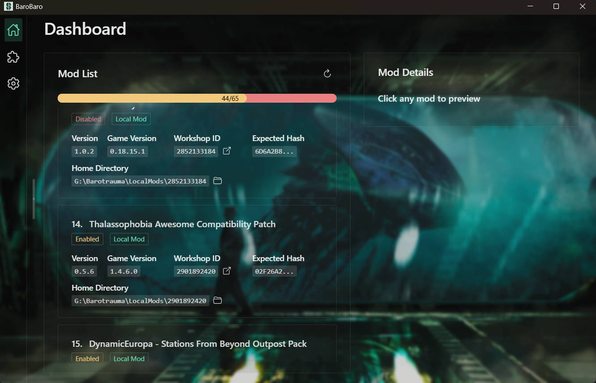

# BaroBaro-Barotrauma Mod Manager

A dedicated mod manager for Barotrauma, built with Tauri, Vue 3, and TypeScript. This application helps you manage your
Barotrauma mods with ease, allowing you to install, update, and organize your mods through an intuitive interface.

## Preview

  

## Features

- [x] **Mod Management**: Install, update, and remove Barotrauma mods
- [ ] **Profile System**: Create and manage mod profiles for different gameplay experiences
- [ ] **Steam Workshop Integration**: Download mods directly from the Steam Workshop
- [ ] **Drag & Drop Organization**: Easily reorder your mods with drag and drop functionality

## Recommended IDE Setup

- [VS Code](https://code.visualstudio.com/) + [Vue - Official](https://marketplace.visualstudio.com/items?itemName=Vue.volar) + [Tauri](https://marketplace.visualstudio.com/items?itemName=tauri-apps.tauri-vscode) + [rust-analyzer](https://marketplace.visualstudio.com/items?itemName=rust-lang.rust-analyzer)

## Tech Stack

- **Frontend**: Vue 3 + TypeScript + Vite
- **Backend**: Rust (Tauri)
- **Communication**: Protocol Buffers (protobuf)
- **Mod Distribution**: SteamCMD integration

## Getting Started

1. Clone the repository
2. Install dependencies with `pnpm install`
3. Run the development server with `pnpm dev`

## Project Structure

- `src/` - Vue frontend code
- `src-tauri/` - Rust backend code
- `proto/` - Protocol Buffer definitions
- `scripts/` - Build and generation scripts
