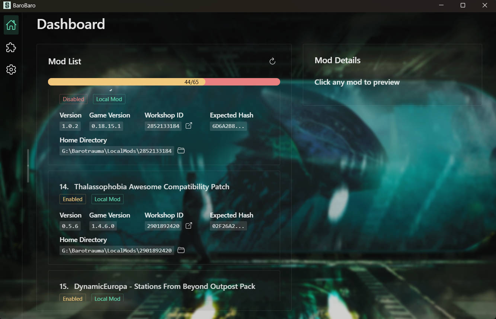

# BaroBaro-Barotrauma Mod Manager

A dedicated mod manager for Barotrauma, built with Tauri, Vue 3, and TypeScript. This application helps you manage your
Barotrauma mods with ease, allowing you to install, update, and organize your mods through an intuitive interface.

## Preview

  

## Features

### Core

- [x] **Mod Management**: Install, update, and remove Barotrauma mods (copy or symlink strategy)
- [x] **Profile System**: Create, apply, and delete mod profiles for different gameplay experiences
- [x] **Steam Workshop Integration**: Download mods via SteamCMD, validate items, retrieve metadata
- [x] **Settings & Configuration**: TOML-persisted config with game paths, install strategy, and UI preferences

### UI & UX

- [x] **Dashboard**: Mod overview with details, build info, and active mod list
- [x] **Theme System**: Dark/Light mode with configurable background blur and opacity
- [x] **Internationalization**: English and Chinese (EN/ZH) via vue-i18n
- [x] **Colored Mod Tags**: Visual tag system for mod categorization

### Technical

- [x] **Mod Hashing**: Blake3 checksums for mod integrity verification
- [x] **Mod Metadata Enrichment**: Local mods augmented with Steam Workshop data (size, subscribers, likes, creator)
- [x] **Game Config Parsing**: Reads `config_player.xml` to extract enabled mods
- [x] **Bulk Operations**: Batch download and batch uninstall
- [x] **Protobuf IPC**: All data structures serialized via Protocol Buffers
- [x] **Structured Logging**: tracing + tracing-subscriber with env filter

## Roadmap

- [ ] **Drag & Drop Reordering**: Reorder mods with drag and drop (foundation exists — `ModList.mods` preserves order)
- [ ] **True Mod Updates**: Hash-diff based updates instead of full uninstall+reinstall
- [ ] **Active Profile Indicator**: Show active profile name on the dashboard
- [ ] **Profile Enhancements**: Rename, compare, import/export, auto-backup before apply
- [ ] **Mod Conflict Detection**: Dependency graph analysis from `content.xml` metadata
- [ ] **Auto-Update Polling**: Periodic Steam API checks for mod version changes
- [ ] **Offline Mode**: Graceful degradation when SteamCMD is unavailable, cached metadata
- [ ] **Workshop Browsing**: In-app search and browse Steam Workshop (currently ID/URL input only)

## Recommended IDE Setup

- [VS Code](https://code.visualstudio.com/) + [Vue - Official](https://marketplace.visualstudio.com/items?itemName=Vue.volar) + [Tauri](https://marketplace.visualstudio.com/items?itemName=tauri-apps.tauri-vscode) + [rust-analyzer](https://marketplace.visualstudio.com/items?itemName=rust-lang.rust-analyzer)

## Tech Stack

- **Frontend**: Vue 3 + TypeScript + Vite
- **Backend**: Rust (Tauri)
- **Communication**: Protocol Buffers (protobuf)
- **Mod Distribution**: SteamCMD integration

## Getting Started

1. Clone the repository
2. Install dependencies with `pnpm install`
3. Run the development server with `pnpm dev`

## Project Structure

- `src/` - Vue frontend code
- `src-tauri/` - Rust backend code
- `proto/` - Protocol Buffer definitions
- `scripts/` - Build and generation scripts
