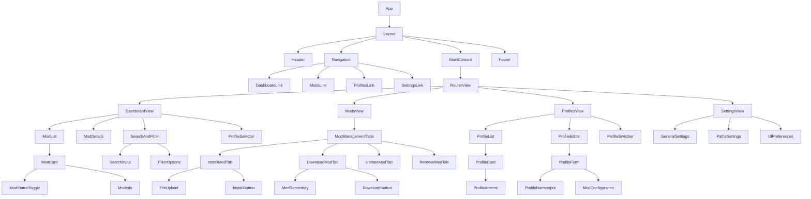

# Game Mod Manager - UI Architecture Design

## Component Architecture and Hierarchy



## Component Responsibilities

### Core Components

#### App.vue

- Root component that initializes the application
- Sets up global state and event listeners
- Handles application-level routing

#### Layout.vue

- Provides the overall application layout structure
- Contains header, navigation, main content area, and footer
- Manages responsive layout behavior

#### Header.vue

- Displays application title and logo
- Shows current user context or profile
- Contains global actions (e.g., notifications, user menu)

#### Navigation.vue

- Main navigation menu
- Handles routing between different sections
- Highlights the current active section

#### MainContent.vue

- Container for the main application content
- Uses Vue Router to display different views
- Manages transitions between views

#### Footer.vue

- Displays application version and copyright information
- Contains links to documentation or support

### Dashboard Components

#### DashboardView.vue

- Main dashboard showing installed mods overview
- Integrates mod list, search, and profile switching
- Provides quick access to common actions

#### ModList.vue

- Displays a list of installed mods
- Supports sorting and basic filtering
- Communicates with ModCard components

#### ModCard.vue

- Represents a single mod in the list
- Shows mod name, version, author, and status
- Contains enable/disable toggle
- Provides quick actions (update, remove)

#### ModDetails.vue

- Detailed view of a selectAnMod mod
- Shows comprehensive information (description, dependencies, etc.)
- Displays mod status and actions

#### SearchAndFilter.vue

- Provides search input and filter options
- Handles filtering logic for the mod list
- Maintains filter state

#### ProfileSelector.vue

- Allows switching between game profiles
- Shows current active profile
- Triggers profile change events

### Mod Management Components

#### ModsView.vue

- Main view for mod management operations
- Contains tabs for different management actions
- Coordinates between sub-components

#### ModManagementTabs.vue

- Tabbed interface for mod operations
- Manages tab selection state
- Displays appropriate content for each tab

#### InstallModTab.vue

- Handles installation of local mod files
- Provides file upload functionality
- Shows installation progress and results

#### DownloadModTab.vue

- Interface for downloading mods from remote sources
- Displays available mods from repositories
- Handles download progress and installation

#### UpdateModTab.vue

- Shows mods with available updates
- Provides bulk or individual update options
- Displays update progress

#### RemoveModTab.vue

- Lists installed mods that can be removed
- Provides removal confirmation workflow
- Handles dependency checks before removal

### Profile Management Components

#### ProfilesView.vue

- Main view for profile management
- Integrates profile list and editor
- Coordinates profile-related operations

#### ProfileList.vue

- Displays all created game profiles
- Allows profile selection and management
- Communicates with ProfileCard components

#### ProfileCard.vue

- Represents a single profile in the list
- Shows profile name and basic information
- Provides actions (edit, delete, duplicate)

#### ProfileEditor.vue

- Form for creating or editing profiles
- Manages profile data input
- Handles validation and saving

#### ProfileSwitcher.vue

- Quick profile switching component
- Can be used in header or dashboard
- Provides immediate profile change capability

### Settings Components

#### SettingsView.vue

- Main view for application settings
- Organizes settings into sections
- Manages settings save/load operations

#### GeneralSettings.vue

- Basic application settings
- Language, theme, and general preferences

#### PathsSettings.vue

- Configuration for game installation paths
- Download locations and storage settings
- Path validation and browsing capabilities

#### UIPreferences.vue

- User interface customization options
- Theme selection, layout preferences
- Display and behavior settings

## State Management Approach

### Global State

The application will use a combination of Vue's Composition API and a centralized store pattern for state management:

1. **Vue Reactive System**: For component-level state and simple shared state
2. **Provide/Inject**: For passing data down the component tree without props drilling
3. **Pinia**: For complex global state management (if needed)

### State Structure

```typescript
interface AppState {
  // Current user preferences
  preferences: {
    theme: 'light' | 'dark' | 'system';
    language: string;
    gamePaths: Record<string, string>;
    downloadPath: string;
  };
  
  // Mod data
  mods: Mod[];
  selectedModId: string | null;
  
  // Profile data
  profiles: Profile[];
  activeProfileId: string;
  
  // UI state
  isLoading: boolean;
  notifications: Notification[];
  searchQuery: string;
  activeFilters: FilterOptions;
}

interface Mod {
  id: string;
  name: string;
  version: string;
  author: string;
  description: string;
  enabled: boolean;
  installedAt: Date;
  updatedAt: Date;
  dependencies: string[];
  conflicts: string[];
  filePath: string;
  source: 'local' | 'remote';
}

interface Profile {
  id: string;
  name: string;
  gameId: string;
  modConfigurations: Record<string, boolean>; // modId: enabled
  createdAt: Date;
  updatedAt: Date;
}

interface Notification {
  id: string;
  type: 'info' | 'success' | 'warning' | 'error';
  message: string;
  timestamp: Date;
  read: boolean;
}
```

### State Management Responsibilities

1. **App State Management**:
    - Initialize and maintain global application state
    - Handle persistence of user preferences
    - Manage loading states and notifications

2. **Mod State Management**:
    - Track installed mods and their status
    - Handle mod selection and detailed views
    - Manage search and filter criteria

3. **Profile State Management**:
    - Maintain list of game profiles
    - Track active profile
    - Handle profile switching and updates

## Recommended UI Libraries and Frameworks

### Vue 3 Compatible Libraries

1. **Element Plus**:
    - Comprehensive component library for Vue 3
    - Good TypeScript support
    - Professional look and feel
    - Components for tables, forms, modals, etc.

2. **Naive UI**:
    - Modern Vue 3 component library
    - Lightweight with good customization options
    - Excellent TypeScript support
    - Theme customization capabilities

3. **PrimeVue**:
    - Rich set of UI components
    - Multiple theme options
    - Good accessibility support
    - Comprehensive documentation

### Tauri Integration Considerations

1. **File System Access**:
    - Use Tauri's file system APIs for local file operations
    - Implement secure file browsing for game paths
    - Handle file upload/download through Tauri

2. **System Dialogs**:
    - Use Tauri's dialog APIs for file selection
    - Implement native system notifications
    - Handle error dialogs through Tauri

3. **Performance Optimization**:
    - Leverage Tauri's performance for file operations
    - Use Rust backend for heavy processing tasks
    - Implement efficient data handling for large mod lists

## Design System Guidelines

### Color Palette

#### Primary Colors

- Primary: `#3B82F6` (Blue-500) - Main brand color
- Primary Dark: `#1D4ED8` (Blue-700) - For hover states
- Primary Light: `#93C5FD` (Blue-300) - For subtle backgrounds

#### Secondary Colors

- Success: `#10B981` (Green-500) - Positive actions and status
- Warning: `#F59E0B` (Amber-500) - Cautionary information
- Error: `#EF4444` (Red-500) - Error states and destructive actions
- Info: `#6366F1` (Indigo-500) - Neutral information

#### Neutral Colors

- Background: `#F9FAFB` (Light) / `#111827` (Dark)
- Surface: `#FFFFFF` (Light) / `#1F2937` (Dark)
- Text Primary: `#111827` (Light) / `#F9FAFB` (Dark)
- Text Secondary: `#6B7280` (Light) / `#9CA3AF` (Dark)
- Border: `#E5E7EB` (Light) / `#374151` (Dark)

### Typography

#### Font Family

- Primary: `-apple-system, BlinkMacSystemFont, 'Segoe UI', Roboto, 'Helvetica Neue', Arial, sans-serif`
- Monospace: `'SFMono-Regular', Consolas, 'Liberation Mono', Menlo, monospace`

#### Font Sizes

- Heading 1: `2rem` (32px) - Page titles
- Heading 2: `1.5rem` (24px) - Section titles
- Heading 3: `1.25rem` (20px) - Subsection titles
- Body Large: `1.125rem` (18px) - Emphasized text
- Body Regular: `1rem` (16px) - Standard text
- Body Small: `0.875rem` (14px) - Supporting text
- Caption: `0.75rem` (12px) - Legal, credits

#### Font Weights

- Light: 300
- Regular: 400
- Medium: 500
- Semi-bold: 600
- Bold: 700

### Spacing System

#### Base Unit

- Base spacing unit: `0.25rem` (4px)

#### Spacing Scale

- XXS: `0.25rem` (4px) - Component inner spacing
- XS: `0.5rem` (8px) - Element padding
- S: `0.75rem` (12px) - Component padding
- M: `1rem` (16px) - Component margin
- L: `1.5rem` (24px) - Section padding
- XL: `2rem` (32px) - Section margin
- XXL: `3rem` (48px) - Page padding

### Border Radius

- Sharp: `0` - For strict geometric shapes
- Soft: `0.25rem` (4px) - For buttons and small components
- Rounded: `0.5rem` (8px) - For cards and containers
- Circular: `9999px` - For badges and circular elements

### Shadows

#### Elevation Levels

- Level 0: `none` - Flat elements
- Level 1: `0 1px 2px 0 rgba(0, 0, 0, 0.05)` - Subtle depth
- Level 2: `0 4px 6px -1px rgba(0, 0, 0, 0.1), 0 2px 4px -1px rgba(0, 0, 0, 0.06)` - Cards and modals
- Level 3: `0 10px 15px -3px rgba(0, 0, 0, 0.1), 0 4px 6px -2px rgba(0, 0, 0, 0.05)` - Floating elements

## Mod Management Features Implementation

### Install New Mods from Local Files

1. **File Upload Component**:
    - Use Tauri's file dialog to select mod files
    - Support for drag-and-drop functionality
    - File validation (format, size)

2. **Installation Process**:
    - Parse mod metadata from file
    - Check for conflicts with existing mods
    - Copy files to appropriate game directory
    - Update application state with new mod

3. **User Feedback**:
    - Progress indicators for file operations
    - Success/error notifications
    - Option to enable mod immediately after installation

### Download Mods from Remote Sources

1. **Repository Integration**:
    - Connect to mod repositories (e.g., Nexus, Steam Workshop)
    - Display available mods with search and filtering
    - Show mod details, ratings, and download counts

2. **Download Process**:
    - Queue management for multiple downloads
    - Progress tracking for each download
    - Automatic installation after download completion

3. **Security Considerations**:
    - Validate downloaded files
    - Scan for malware (if possible through backend)
    - Maintain download history

### Update Existing Mods

1. **Update Detection**:
    - Compare installed mod versions with repository versions
    - Highlight mods with available updates
    - Show changelogs when available

2. **Update Process**:
    - Backup current mod version before updating
    - Download and install new version
    - Preserve user configurations when possible

3. **Batch Operations**:
    - Select multiple mods for bulk updates
    - Schedule updates for later
    - Handle update dependencies

### Remove/Uninstall Mods

1. **Removal Process**:
    - Confirm removal action with user
    - Check for dependent mods
    - Remove mod files and update application state

2. **Safety Features**:
    - Warn about dependencies that might break
    - Offer to remove dependent mods as well
    - Provide undo functionality for recent removals

## Game Profile Management

### Multiple Game Profiles

1. **Profile Creation**:
    - Form for creating new profiles
    - Associate with specific game installations
    - Set initial mod configurations

2. **Profile Storage**:
    - Save profile configurations locally
    - Export/import profiles as files
    - Sync profiles across devices (future feature)

### Profile-Specific Mod Configurations

1. **Configuration Management**:
    - Track which mods are enabled for each profile
    - Store profile-specific mod settings
    - Handle mod compatibility per profile

2. **Configuration Application**:
    - Apply mod configurations when switching profiles
    - Validate configurations for conflicts
    - Provide visual feedback on configuration status

### Easy Switching Between Profiles

1. **Profile Switcher**:
    - Quick access dropdown in header
    - Visual indicator of current profile
    - Recently used profiles list

2. **Switch Process**:
    - Save current profile state
    - Apply new profile configurations
    - Refresh mod list and status indicators

## Settings/Preferences

### Game Installation Paths

1. **Path Management**:
    - Form fields for different game installation paths
    - Browse button using Tauri file dialogs
    - Validation of selectAnMod paths

2. **Auto-Detection**:
    - Attempt to auto-detect common game installation locations
    - Registry scanning for Windows games
    - Steam library folder detection

### Download Locations

1. **Download Directory**:
    - Configure default download location
    - Separate locations for different game profiles
    - Disk space monitoring

2. **Organization Options**:
    - Automatic folder organization by game
    - Custom naming patterns for downloaded files
    - Cleanup options for old downloads

### UI Preferences

1. **Theme Settings**:
    - Light/dark/system theme options
    - Custom accent color selection
    - High contrast mode for accessibility

2. **Layout Options**:
    - Compact vs. spacious layout
    - Sidebar position and visibility
    - Default view preferences

3. **Behavior Settings**:
    - Auto-check for updates
    - Notification preferences
    - Performance optimization options

## Additional Features

### Mod Dependencies Tracking

1. **Dependency Resolution**:
    - Parse dependency information from mod metadata
    - Visualize dependency trees
    - Automatic installation of missing dependencies

2. **Dependency Management**:
    - Warn when removing mods with dependents
    - Offer to remove dependent mods together
    - Show impact of dependency changes

### Conflict Detection

1. **Conflict Identification**:
    - Compare mod file paths for overlaps
    - Check declared conflicts in mod metadata
    - Analyze mod compatibility heuristics

2. **Conflict Resolution**:
    - Highlight conflicting mods
    - Suggest resolution options
    - Prevent enabling conflicting mods together

### Backup/Restore Functionality

1. **Backup Creation**:
    - Full profile backups including mod configurations
    - Selective mod backups
    - Scheduled automatic backups

2. **Restore Process**:
    - List available backups with timestamps
    - Preview backup contents before restoration
    - Selective restoration of specific elements

3. **Backup Management**:
    - Storage location for backup files
    - Backup size monitoring
    - Automatic cleanup of old backups